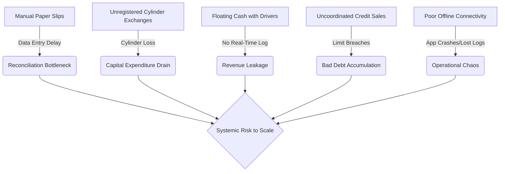

# PRODUCT REQUIREMENTS DOCUMENT (PRD)
## Project Name: LPG Enterprise ERP + Field Operations System
## Document Version: 1.0.0
## Author: Senior Enterprise Solution Architect
## Target Audience: Developers, AI Engineering Agents, UI/UX Designers, Operations Managers, Investors

---

## SECTION 1 — EXECUTIVE OVERVIEW

### 1.1 Business Summary
The LPG Enterprise ERP & Field Operations System is an industrial-grade logistics, inventory, and financial control platform designed specifically for commercial Liquefied Petroleum Gas (LPG) distributors. The business operates a hub-and-spoke distribution network centered around physical warehouses, managing a fleet of delivery trucks to distribute high-value, heavy-duty **45.2 KG Commercial LPG Cylinders** to commercial kitchens, restaurants, hotels, and industrial consumers. Operations are characterized by a high volume of credit-based transactions, dynamic fleet dispatching, cash/cheque collections on-the-road, and a mandatory 1:1 physical cylinder exchange model (delivering a full cylinder and recovering an empty cylinder shell).

### 1.2 Operational Problem Statement
The current manual, paper-ledger-based operation introduces systemic vulnerability across several key business vectors:
1. **Asset Leakage (Cylinder Loss):** 45.2 KG cylinder steel shells represent a substantial capital expenditure (approx. $100–$150 per empty shell). Inadequate tracking leads to customers retaining cylinders indefinitely, drivers failing to retrieve empties, or cylinders being diverted to competitor networks.
2. **Revenue and Cash Leakage:** Drivers collect cash and cheques during deliveries. Without real-time tracking, cash remains "floating" in drivers' pockets for days, leading to micro-loans, delayed deposits, or unaccounted shortfalls.
3. **Credit Control Failure:** Credit limits and credit payment terms are currently managed via manual ledgers. Credit sales are frequently authorized for customers who have exceeded their limits or have overdue outstanding payments, increasing bad debt risk.
4. **Dispatch and Route Inefficiency:** Dispatchers assign orders without real-time inventory visibility or route optimization, resulting in trucks leaving under-loaded or driving overlapping routes.
5. **Reconciliation Bottlenecks:** End-of-shift reconciliation for drivers is a chaotic manual process. Accountants spend hours matching delivery slips, cylinder return receipts, cash collections, and fuel/toll expense bills, frequently resolving disputes with incomplete data.
6. **Network Instability:** Field operations occur in dense commercial districts or semi-rural pockets where internet connectivity is intermittent. Standard cloud-based mobile apps fail during offline transitions, leading to duplicate records or lost delivery proofs.



### 1.3 Goals of the ERP
- **Zero-Loss Asset Tracking:** Maintain a real-time count-based and future-serialized ledger of full, empty, and damaged cylinders across warehouses, trucks, and customer locations.
- **Immediate Financial Reconciliation:** Automate driver shift close reconciliation, matching physical cash, cheques, and credit signatures against expected values, flagging discrepancies within a 0-tolerance ledger framework.
- **Strict Credit Enforcement:** Lock order creation and dispatch automatically for blocked or limit-exceeded customer accounts.
- **Offline-First Delivery Reliability:** Equipt drivers with a mobile application capable of executing full delivery workflows, logging cylinder exchanges, and capturing payment signatures completely offline, syncing automatically when connectivity resumes.
- **Operational Auditability:** Ensure every physical asset move and financial ledger edit is logged immutably, eliminating deletion capabilities to prevent internal fraud.

### 1.4 Expected Business Impact
- **Cylinder Recovery Rate:** Increase from a baseline of ~88% to a guaranteed 99.8%.
- **Cash Reconciliation Cycle:** Reduce from 48–72 hours to <15 minutes post-shift.
- **Bad Debt Write-offs:** Reduce by 90% via automated credit controls and system-enforced blocking.
- **Fleet Efficiency:** Increase cylinder deliveries per kilometer by 20% through structured dispatch controls.
- **Operational Auditing:** 100% transparency with zero destructive edits on any transactional ledger database.

---

## SECTION 2 — BUSINESS MODEL UNDERSTANDING

### 2.1 Core Product
The singular unit of distribution is the **45.2 KG Commercial LPG Cylinder**. This is a heavy, steel-enclosed pressurized cylinder containing liquefied petroleum gas. 
- **Physical States:**
  - **Full Cylinder (FC):** Contains 45.2 KG of LPG. Ready for delivery. Heavy, requires physical labor/trolleys.
  - **Empty Cylinder (EC):** Depleted cylinder returned by the customer. Highly valuable shell asset.
  - **Damaged Cylinder (DC):** Defective, dented, valve-compromised, or leaking cylinder. Unusable until re-certified or scrapped.
- **Commercial Structure:** Customers pay for the gas content (LPG refill) but must provide an empty cylinder in exchange. If a customer does not have an empty cylinder to return, they must pay an asset deposit or have a cylinder liability recorded against their ledger.

### 2.2 Target Customers
The business serves B2B commercial entities operating high-utilization kitchens:
- **Restaurants & Diners:** Require regular, time-sensitive deliveries. High-frequency cash or short-term credit.
- **Hotels & Resorts:** Large-volume consumers, structured corporate billing, strict delivery schedules, mandatory purchase order matching.
- **Commercial Kitchens & Caterers:** High-demand peaks, flexible locations, dynamic delivery requests.
- **Food Processing Industries:** Bulk contract customers, high volume, specialized safety protocols, long-term credit.

### 2.3 Business Operations Layout
```
[LPG Refilling Plant] 
       │ (Inbound Full / Outbound Empty Truckloads)
       ▼
[Central Warehouse / Hub] ◄───► [Warehouse Manager] (Manages Stock & Quality Control)
       │ (Assigned Loads: Full Cylinders + Delivery Route)
       ▼
[Delivery Trucks / Fleet] ◄───► [Drivers] (Deliver Fulls, Recover Empties, Collect Payments)
       │
       ├─► [Restaurant A] ───► (1:1 Swap: 5 Fulls Delivered ◄──► 5 Empties Recovered)
       │
       ├─► [Hotel B] ────────► (Imbalance: 10 Fulls Delivered ◄──► 8 Empties Recovered. 2 Recorded as Liability)
       │
       └─► [Kitchen C] ──────► (Credit Account: Delivery signed off ◄──► Post-dated cheque collected)
```

---

## SECTION 3 — CORE BUSINESS WORKFLOWS

### 3.1 Warehouse Refill Workflow
Manages the outward movement of empty cylinders from the distributor's warehouse to the third-party LPG filling plant and the subsequent inward return of filled cylinders.
- **Actors:** Warehouse Manager, Back-Office Operator.
- **Step-by-Step Flow:**
  1. Warehouse Manager selects empty cylinders for refilling and initiates a "Refill Dispatch" order in the ERP.
  2. The system decrements the warehouse `Empty_Cylinder` count and increments `Refill_In_Transit` inventory.
  3. Gate Pass is printed containing empty counts, transport vehicle ID, and driver signature.
  4. At the LPG plant, cylinders are refilled. The plant issues a Delivery Challan / Invoice.
  5. The vehicle returns. Warehouse Manager counts the incoming full cylinders, inspects them for defects, and logs the intake in the ERP against the original Gate Pass.
  6. Warehouse Manager inputs the LPG plant invoice number, gross weight, and cylinder count.
  7. The system decrements `Refill_In_Transit`, increments warehouse `Full_Cylinder` inventory, and records a liability to the LPG plant vendor account.
- **Validations:**
  - Outgoing cylinder count must match Gate Pass count.
  - Returned full cylinder count + rejected empty count must equal the dispatched empty count. If there is a shortfall, the transaction cannot be closed without entering a "Shortage Dispute" log.
- **Approval Requirements:** Warehouse Manager signature for intake; Back-Office approval if plant invoice value varies by >2% from pre-configured contractual pricing.
- **System Events Triggered:** `INVENTORY_REFILL_DISPATCHED`, `INVENTORY_REFILL_RECEIVED`, `VENDOR_LIABILITY_CREATED`.
- **Edge Cases:** LPG plant rejects 3 empty cylinders as unfit for refilling.
- **Exception Handling:** Rejected cylinders must be marked as "Damaged - Quarantined" and returned to the warehouse, decrementing the active fleet size.

---

### 3.2 Order Placement Workflow
- **Actors:** Customer, Back-Office Operator, Accountant (if credit check fails).
- **Step-by-Step Flow:**
  1. Customer requests refills via call, WhatsApp, or customer portal.
  2. Back-Office Operator searches for the customer record in the ERP.
  3. System automatically evaluates customer status (Active vs. Blocked) and credit terms.
  4. Operator inputs the required quantity of 45.2 KG cylinders, requested delivery date, and payment terms (Cash on Delivery, Cheque on Delivery, or Credit Ledger).
  5. System checks available warehouse `Full_Cylinder` stock.
  6. Order is saved as `Draft` or `Assigned` to a dispatch queue.
- **Validations:**
  - Customer account must not be blocked.
  - Credit customers: Order value + current outstanding ledger balance must not exceed the customer's approved Credit Limit.
  - If a credit breach occurs, the system locks the order with status `Blocked`.
- **Approval Requirements:** Accountant or Business Owner credentials required to override a credit block.
- **System Events Triggered:** `ORDER_CREATED`, `CREDIT_LIMIT_EXCEEDED` (if blocked).
- **Edge Cases:** Customer has a pending cheque that has not cleared yet, meaning their credit limit is temporarily exhausted but will clear tomorrow.
- **Exception Handling:** System permits an "Under-Verification Clearance" only with Business Owner's signed digital override code.

---

### 3.3 Dispatch Workflow
- **Actors:** Back-Office Operator, Warehouse Manager, Driver.
- **Step-by-Step Flow:**
  1. Back-Office Operator groups pending orders into a "Delivery Trip" and assigns a Driver and Truck.
  2. ERP compiles the total number of full cylinders required for the trip.
  3. Trip is sent to the Warehouse Manager's interface.
  4. Warehouse Manager physically loads the truck, scans or enters the quantity loaded, and confirms the load in the ERP.
  5. Driver logs into the Mobile App, views the assigned trip, and taps "Accept Dispatch" after verifying the truck load count.
  6. System transfers stock from warehouse `Full_Cylinder` count to truck-specific `Transit_Full_Cylinder` inventory.
- **Validations:**
  - Loaded cylinder count must match trip requirements exactly.
  - Truck cargo capacity must not be exceeded.
  - Driver must have zero open un-reconciled prior shifts.
- **Approval Requirements:** Warehouse Manager must electronically sign off on the Gate Pass.
- **System Events Triggered:** `TRIP_DISPATCHED`, `TRUCK_STOCK_DEBITED`, `DRIVER_SHIFT_ACTIVATED`.
- **Edge Cases:** Driver discovers a cylinder is leaking during physical loading.
- **Exception Handling:** Manager marks cylinder as damaged in inventory, decrements loaded count, and replaces it with another full cylinder before dispatch confirmation.

---

### 3.4 Delivery Workflow
- **Actors:** Driver, Customer Representative.
- **Step-by-Step Flow:**
  1. Driver arrives at the customer location and updates app state to `Arrived` (capturing GPS and timestamp).
  2. Driver unloads the required quantity of Full Cylinders.
  3. Driver counts and retrieves Empty Cylinders from the customer.
  4. Driver logs the delivery in the app: Full Cylinders Delivered, Empty Cylinders Received.
  5. Customer representative signs on the mobile screen. Driver captures a photo of the delivered cylinders installed in the customer's manifold.
  6. Driver submits delivery. System shifts order state to `Delivered Unverified`.
- **Validations:**
  - GPS coordinates of submission must be within 100 meters of the customer's registered location. If not, the app prompts for a mandatory justification note and flags it for audit.
- **Approval Requirements:** Customer signature captured on screen.
- **System Events Triggered:** `DELIVERY_COMPLETED`, `CUSTOMER_CYLINDER_BALANCE_UPDATED`, `GPS_GEOFENCE_VIOLATED` (if outside radius).
- **Edge Cases:** Customer representative is not present, but kitchen staff insists on drop-off.
- **Exception Handling:** Driver logs "Indirect Handover," captures a mandatory photo of the staff member and cylinders, and uploads a voice note explaining the situation.

---

### 3.5 Empty Cylinder Exchange Workflow
- **Actors:** Driver, Customer Representative, Warehouse Manager.
- **Step-by-Step Flow:**
  1. During delivery, the driver calculates the cylinder swap balance: `Imbalance = Fulls Delivered - Empties Received`.
  2. If `Imbalance = 0`: Standard 1:1 exchange.
  3. If `Imbalance > 0` (e.g., delivered 5, received 3): Customer owes 2 empty cylinders. System logs a credit of 3 empties and updates the customer's `Empty_Cylinder_Liability` record by +2.
  4. If `Imbalance < 0` (e.g., delivered 5, received 7): Customer returned extra empties. System updates customer's `Empty_Cylinder_Liability` record by -2.
  5. Upon returning to the warehouse, the Warehouse Manager counts physical empties offloaded from the truck.
  6. System reconciles truck inventory: `Truck_Transit_Empties` must match offloaded count.
- **Validations:**
  - Imbalances must be agreed upon by the customer via digital signature on the mobile app.
- **Approval Requirements:** Any negative imbalance (customer returning fewer empties than fulls) for cash-only accounts requires a deposit payment unless authorized by Back-Office override.
- **System Events Triggered:** `CYLINDER_LIABILITY_MODIFIED`, `TRUCK_EMPTY_STOCK_RECONCILED`.
- **Edge Cases:** Customer claims they previously returned extra cylinders that were not recorded.
- **Exception Handling:** Driver cannot override. Customer must contact Back-Office to audit the customer ledger history.

---

### 3.6 Payment Collection Workflow
- **Actors:** Driver, Customer Accountant, Accountant.
- **Step-by-Step Flow:**
  1. For Cash-on-Delivery (COD) or credit accounts paying on delivery, Driver prompts for payment.
  2. Driver selects payment method in the Mobile App:
     - **Cash:** Driver enters cash amount collected.
     - **Cheque:** Driver logs Cheque Number, Bank Name, Expiry Date, Cheque Amount, and takes a clear photo of the cheque.
     - **Bank Transfer (Direct Deposit):** Driver inputs transaction reference code and takes a photo of the customer's bank receipt.
  3. Driver submits collection. Transaction is marked as `Awaiting Verification`.
  4. Collected cash/cheques are carried in the driver's secure shift bag.
- **Validations:**
  - Cheque photo is mandatory if Cheque is selected.
  - Payment amount logged cannot exceed order total + outstanding balance.
- **Approval Requirements:** Final ledger credit is pending until Accountant verifies physical cash and clears cheque logs in the web panel.
- **System Events Triggered:** `PAYMENT_COLLECTED`, `AWAITING_FINANCIAL_VERIFICATION`.
- **Edge Cases:** Customer pays partial cash and partial cheque.
- **Exception Handling:** Mobile app supports split-payment logging (e.g., Cash: $50, Cheque: $100) under a single payment collection event.

---

### 3.7 Recovery Collection Workflow
- **Actors:** Recovery Agent, Customer Representative, Accountant.
- **Step-by-Step Flow:**
  1. Recovery Agent is assigned a "Recovery Route" of overdue credit customers.
  2. Agent visits customer, reviews the current outstanding ledger, and collects outstanding dues.
  3. Agent logs the collection in the Recovery Mobile App (Cash, Cheque, or Bank Transfer).
  4. Agent issues a digital receipt containing a unique transaction hash to the customer (via SMS/WhatsApp).
  5. At the end of the day, the Recovery Agent hands over all physical collections to the Accountant.
- **Validations:**
  - GPS coordinates validation on logging.
  - Receipt number tracking must be sequential to prevent pocketing of cash.
- **Approval Requirements:** Accountant reconciliation sign-off.
- **System Events Triggered:** `RECOVERY_PAYMENT_LOGGED`, `RECOVERY_RECONCILED`.
- **Edge Cases:** Customer disputes the balance amount shown on the agent's app, claiming they already paid the driver.
- **Exception Handling:** Agent logs a "Balance Dispute" event, attaches a photo of the customer's receipt, and the system routes the dispute to the Accountant for ledger auditing.

---

### 3.8 Credit Customer Workflow
- **Actors:** Back-Office Operator, Accountant, Business Owner.
- **Step-by-Step Flow:**
  1. Operator submits a Credit Customer Application in the ERP with business documents, KYC details, and a requested Credit Limit (amount) and Credit Terms (e.g., Net 15 days).
  2. Accountant audits the documents and reviews creditworthiness.
  3. Business Owner approves or adjusts the Credit Limit.
  4. Once approved, the customer is assigned a credit wallet in the ledger system.
  5. Every delivery automatically posts a Debit entry to the customer's ledger, reducing available credit.
  6. Every verified payment posts a Credit entry, restoring available credit.
- **Validations:**
  - Credit limit must be > 0.
  - Dual authorization required (Accountant reviews, Business Owner approves).
- **Approval Requirements:** Business Owner signature.
- **System Events Triggered:** `CREDIT_PROFILE_ACTIVATED`, `CREDIT_LIMIT_MODIFIED`.
- **Edge Cases:** A restaurant group wants a shared credit limit across three branch locations.
- **Exception Handling:** ERP supports a "Parent-Child" account hierarchy where the Parent profile holds the credit limit, and Child locations debit the parent credit pool.

---

### 3.9 Shift Closing Workflow
- **Actors:** Driver, Warehouse Manager, Accountant.
- **Step-by-Step Flow:**
  1. Driver returns to the warehouse. Warehouse Manager offloads the truck, counting returned fulls, returned empties, and damaged cylinders.
  2. Warehouse Manager confirms the inventory return counts in the ERP.
  3. Driver proceeds to the Accountant's office and hands over the secure cash bag.
  4. Accountant inputs the physical cash, cheque amounts, and bank transfer receipts.
  5. The ERP Shift Engine runs reconciliation:
     - Expected Cash = (Beginning Cash + Cash Deliveries + Credit Payments Collected) - Approved Cash Expenses.
     - Expected Empties = (Initial Empties Loaded + Empties Recovered) - Empties Swapped.
  6. The system displays the difference: `Variance = Physical Cash/Empties - Expected Cash/Empties`.
  7. If Variance = 0, the shift is closed with status `Reconciled`.
  8. If Variance != 0, the Accountant logs a dispute and flags the shift.
- **Validations:**
  - Shift closing cannot be processed until the Warehouse Manager has finalized the returned inventory checks.
- **Approval Requirements:** Accountant signature to seal the shift ledger.
- **System Events Triggered:** `SHIFT_CLOSE_INITIATED`, `SHIFT_RECONCILED`, `SHIFT_DISCREPANCY_DETECTED`.
- **Edge Cases:** Driver claims they lost cash during a delivery dispute.
- **Exception Handling:** The shortage is posted to a `Driver_Shortage_Suspense` account, and a payroll deduction ledger entry is scheduled if not cleared within 48 hours.

---

### 3.10 Expense Claim Workflow
- **Actors:** Driver, Warehouse Manager, Accountant.
- **Step-by-Step Flow:**
  1. Driver incurs an expense on the road (e.g., fuel refill, highway toll, truck tire puncture).
  2. Driver logs the expense in the Mobile App: selects Expense Category (Fuel, Toll, Maintenance, Misc), enters amount, and takes a photo of the receipt.
  3. For fuel, Driver must input truck odometer reading.
  4. System logs the expense as `Awaiting Approval` and displays it in the Shift closing screen.
  5. Accountant reviews the expense claim and receipt image.
  6. Approved expenses deduct from the Driver's expected cash-on-hand calculation for that shift.
- **Validations:**
  - Fuel expense requires odometer value.
  - Receipts are mandatory for claims over $10 (Macro-expenses). Claims under $10 (Micro-expenses) can be logged without a photo but require a text description.
  - GPS check: Fuel claim location must align with route trajectory.
- **Approval Requirements:** Accountant approval for all expenses under $50; Business Owner approval for any maintenance or miscellaneous expense exceeding $50.
- **System Events Triggered:** `EXPENSE_CLAIMED`, `EXPENSE_APPROVED`, `EXPENSE_REJECTED`.
- **Edge Cases:** Driver submits two duplicate claims for the same toll road trip.
- **Exception Handling:** Image hashing detects duplicate receipt uploads and automatically flags the transaction for rejection.

---

### 3.11 Customer Blocking Workflow
- **Actors:** System Scheduler, Accountant, Business Owner.
- **Step-by-Step Flow:**
  1. A daily background cron job scans customer accounts.
  2. System flags accounts meeting block criteria:
     - Ledger balance exceeds credit limit by >10%.
     - Customer has an unpaid invoice overdue by more than 30 days past terms.
     - A cheque submitted by the customer bounced.
  3. System automatically transitions the customer account state to `Blocked`.
  4. Any active orders for this customer in `Draft` or `Assigned` status are immediately transitioned to `Blocked`.
  5. Back-Office cannot create new orders for this customer.
- **Validations:**
  - Automated blocking runs daily at 00:00.
- **Approval Requirements:** Unblocking requires Accountant confirmation of payment receipt or a Business Owner credit limit extension override.
- **System Events Triggered:** `CUSTOMER_BLOCKED`, `ORDER_SUSPENDED`.
- **Edge Cases:** Customer promises to pay cash on the next delivery and needs gas immediately.
- **Exception Handling:** ERP allows a "One-Time Dispatch Override" that unblocks the customer for a single delivery ticket, authorized only by the Business Owner.

---

### 3.12 Ledger Verification Workflow
- **Actors:** Accountant, Bank Feed (or Manual Statement Upload).
- **Step-by-Step Flow:**
  1. Accountant reviews the list of payments marked as `Awaiting Verification`.
  2. Accountant verifies that the cash received during shift close matches the deposit receipts.
  3. Accountant checks the online business bank portal to confirm bank transfers and cheque clearances.
  4. Accountant marks the payment as `Reconciled` in the ERP.
  5. The ERP posts ledger entries to debit the Cash/Bank assets and credit the Customer accounts receivable.
- **Validations:**
  - Bank reference IDs must be unique across the ledger to prevent double reconciliation.
  - Transactions cannot be edited or deleted once marked as `Reconciled`.
- **Approval Requirements:** Accountant authorization.
- **System Events Triggered:** `LEDGER_TRANSACTION_RECONCILED`, `CUSTOMER_BALANCE_UPDATED`.
- **Edge Cases:** Bank transfer reference matches the amount but is submitted by a different customer name.
- **Exception Handling:** Accountant can link the transaction to the correct customer record using a manual matching interface, logging a note explaining the discrepancy.

---

### 3.13 Inventory Intake Workflow
- **Actors:** Warehouse Manager, Back-Office Operator, Supplier Vendor.
- **Step-by-Step Flow:**
  1. Distributor purchases new cylinders or bulk refills from LPG manufacturers.
  2. Delivery truck arrives at the warehouse with inventory.
  3. Warehouse Manager counts the incoming physical cylinders: Brand, Type (Commercial 45.2 KG), and Condition (New, Refilled).
  4. Warehouse Manager logs the intake: inputs purchase order number, supplier challan number, and counts.
  5. Warehouse inventory counts are updated: `Full_Cylinder` or `Empty_Cylinder` count increments.
- **Validations:**
  - Intake counts must match the associated purchase order quantity (+/- 5% allowance for partial dispatches).
- **Approval Requirements:** Warehouse Manager signature.
- **System Events Triggered:** `INVENTORY_INTAKE_COMPLETED`, `WAREHOUSE_STOCK_INCREMENTED`.
- **Edge Cases:** Delivery contains 5 damaged cylinders straight from the manufacturer.
- **Exception Handling:** Manager splits intake: logs 95 as Full, 5 as Damaged/Quarantined, and auto-generates a supplier return note.

---

### 3.14 Damaged Cylinder Workflow
- **Actors:** Driver, Warehouse Manager, Accountant.
- **Step-by-Step Flow:**
  1. A cylinder is identified as damaged (valve leak, body dent, corrosion) by the Driver at delivery or by the Warehouse Manager during sorting.
  2. The actor logs the asset state change in the ERP, inputting cylinder location (Warehouse vs. Truck ID) and damage description.
  3. The system moves the asset from `Full_Cylinder` or `Empty_Cylinder` pools to the `Damaged_Quarantine` pool.
  4. Quarantined cylinders are physically moved to a designated safety zone.
  5. Once a month, a safety inspector reviews quarantined stock.
  6. Cylinders are either sent for professional repair or decommissioned/scrapped.
  7. Accountant posts a depreciation/write-off journal entry for scrapped cylinders.
- **Validations:**
  - Damaged logging requires a description and a mandatory photo of the damaged area.
- **Approval Requirements:** Accountant approval to write off a scrapped cylinder from the asset balance sheet.
- **System Events Triggered:** `CYLINDER_DAMAGED`, `CYLINDER_QUARANTINED`, `CYLINDER_DECOMMISSIONED`.
- **Edge Cases:** A driver returns a dented cylinder but claims it was delivered that way by the supplier.
- **Exception Handling:** Warehouse manager reviews intake logs; if the cylinder was not flagged during supplier intake, liability is flagged for internal driver behavior audit.

---

## SECTION 4 — USER ROLES & RESPONSIBILITIES

Each user actor has a distinct operational lifecycle, access boundary, and fraud profile.

```
+-------------------------------------------------------------------------------------------------+
|                                    DAILY OPERATIONAL LIFECYCLE                                 |
+------------------------------------+------------------------------------------------------------+
| ACTOR                              | CYCLE STEPS                                                |
+------------------------------------+------------------------------------------------------------+
| 1. DRIVER                          | Login -> Vehicle Safety Check -> Loading Verification ->   |
|                                    | Confirm Dispatch -> Route Deliveries & Swaps -> Collect    |
|                                    | Payments -> Log Road Expenses -> Return Inventory Check -> |
|                                    | Handover Cash Bag -> Audit Review -> Signoff & Logout      |
+------------------------------------+------------------------------------------------------------+
| 2. WAREHOUSE MANAGER               | Shift Open -> Inbound Supplier Delivery -> Sort Cylinders  |
|                                    | -> Check Vehicle Stock -> Load Trucks -> Sign Gate Pass    |
|                                    | -> Verify Returned Truck Inventory -> Log Damaged -> Close |
+------------------------------------+------------------------------------------------------------+
| 3. BACK-OFFICE OPERATOR            | Login -> Customer Support -> Order Intake -> Credit Check  |
|                                    | -> Dispatch Planning -> Driver Assignment -> Route Monitor |
+------------------------------------+------------------------------------------------------------+
| 4. ACCOUNTANT                      | Login -> Cash Bag Audits -> Shift Close Approvals -> Expense|
|                                    | Receipt Matching -> Bank Deposit Reconciliations -> Ledger  |
|                                    | Verifications -> Credit Limit Reviews                      |
+------------------------------------+------------------------------------------------------------+
```

### 4.1 Super Admin
- **Login Behavior:** Multi-factor authentication (MFA) mandatory. Web console access only. Hardware security token required.
- **Dashboard Visibility:** System health stats, active tenant data, database status, global log levels, RBAC assignment settings.
- **Allowed Actions:** Edit system configuration, create/modify tenant structures, assign/revoke high-level roles, purge old diagnostic logs (non-transactional), modify global validation rules.
- **Restricted Actions:** Cannot modify or bypass transactional ledger entries (accounting immutability applies globally).
- **Operational Responsibilities:** System uptime, security patch management, core database configurations.
- **Approval Authority:** System-wide schema adjustments, developer API access tokens.
- **Fraud Risks:** Inside threat, developer-level access control breach.
- **Logout Behavior:** Absolute session invalidation after 15 minutes of inactivity.

### 4.2 Back-Office Operator
- **Login Behavior:** Single sign-on (SSO) or password-based web login. Limited to company IP range.
- **Dashboard Visibility:** Live order map, pending dispatches, customer ticket queue, active drivers, current warehouse stock levels.
- **Allowed Actions:** Create/edit customers, input new orders, compile trips, assign orders to drivers, log customer service requests.
- **Restricted Actions:** Cannot approve expense claims, cannot override credit blocks, cannot edit inventory levels directly, cannot verify payment receipts.
- **Operational Responsibilities:** Rapid order intake, route efficiency, customer communication, real-time vehicle monitoring.
- **Approval Authority:** None. All credit or price exceptions must be routed to Accountant/Owner.
- **Fraud Risks:** Side deals with customers to bypass credit checks by creating split accounts; scheduling deliveries to unapproved addresses.
- **Logout Behavior:** Standard logout; auto-session end at 19:00.

### 4.3 Accountant
- **Login Behavior:** Web portal access, password + SMS OTP verification. IP restriction enforced.
- **Dashboard Visibility:** Financial metrics, unpaid accounts, pending expense approvals, driver shift close variances, bank reconciliation feeds, bounced cheque log.
- **Allowed Actions:** Verify payment receipts, approve driver shift Closings, approve business expenses, adjust customer credit levels (within guidelines), post ledger adjustments.
- **Restricted Actions:** Cannot delete ledger records, cannot dispatch warehouse stock physically, cannot modify system security settings.
- **Operational Responsibilities:** Ledger accuracy, cash reconciliation, expense audit, debt recovery tracking.
- **Approval Authority:** Standard credit limit overrides, driver expense approvals (up to $50), shift discrepancy resolution.
- **Fraud Risks:** Collusion with drivers to write off cash shortages; approval of fake expense claims.
- **Logout Behavior:** Shift-end lockout; session terminates automatically after 30 minutes of idle status.

### 4.4 Driver
- **Login Behavior:** Mobile App login via Phone Number + Pin. PIN reset requires Back-Office approval. Supports biometric lock.
- **Dashboard Visibility:** Current assigned trip, order list, navigation maps, current truck cylinder stock (Fulls, Empties, Damaged), expense log button, shift summary.
- **Allowed Actions:** Log delivery status, edit swap counts at delivery point, capture signatures/photos, upload expenses, submit shift close request.
- **Restricted Actions:** Cannot view other drivers' routes, cannot modify customer credit limits, cannot delete delivery records once submitted, cannot view historical warehouse stock.
- **Operational Responsibilities:** Safe transport, accurate cylinder counts, cash collection security, mileage logging.
- **Approval Authority:** None.
- **Fraud Risks:** Pocketing cash payments; falsely reporting full cylinders as damaged; fake fuel expense receipt uploads; returning fewer empties and blaming customer disputes.
- **Logout/End-Shift Behavior:** Driver cannot log out of the mobile app until the Accountant physically signs off on the shift closing in the ERP web panel.

### 4.5 Recovery Agent
- **Login Behavior:** Mobile App login via Phone Number + Pin.
- **Dashboard Visibility:** Assigned customer debt recovery list, payment logging panel, collection history.
- **Allowed Actions:** Log recovery collections (cash, cheques, transfers), view customer payment history, add customer call notes.
- **Restricted Actions:** Cannot create orders, cannot access warehouse inventory, cannot dispatch assets.
- **Operational Responsibilities:** On-site collections, payment dispute logging, customer relationship management.
- **Approval Authority:** None.
- **Fraud Risks:** Collecting cash and logging a delayed check; under-reporting cash collected; pocketing cash and claiming customer defaulted.
- **Logout/End-Shift Behavior:** Daily check-in at office required. Shift closes after cash handover reconciliation with Accountant.

### 4.6 Warehouse Manager
- **Login Behavior:** Web/Tablet portal, password + pin.
- **Dashboard Visibility:** Real-time stock counts (Full, Empty, Damaged), inbound purchase shipments, outgoing trips, quarantine log.
- **Allowed Actions:** Log inbound supplier inventory, verify truck loading inventory, log truck returns, update damaged cylinder status, request inventory audits.
- **Restricted Actions:** Cannot modify customer accounts, cannot view financial ledger details, cannot override credit blocks.
- **Operational Responsibilities:** Stock accuracy, cylinder inspection, truck loading verification, warehouse safety.
- **Approval Authority:** Sign off on truck gate passes and intake reconciliation sheets.
- **Fraud Risks:** Side-selling cylinders from the warehouse; writing off good cylinders as damaged and stealing them.
- **Logout Behavior:** Must execute EOD stock count report before system sign-out at shift end.

### 4.7 Business Owner
- **Login Behavior:** Web console access + Mobile Dashboard. MFA required. Remote access enabled.
- **Dashboard Visibility:** High-level corporate health, profit margins, aging debt reports, cash flow analysis, fleet utilization, system logs.
- **Allowed Actions:** Full system read access, executive approvals, credit override authorizations, vendor contract setups, bank ledger overrides.
- **Restricted Actions:** None. (However, database level immutability prevents even the owner from deleting transactional financial rows to maintain audit readiness).
- **Operational Responsibilities:** Executive oversight, strategic planning, high-risk financial approvals.
- **Approval Authority:** Unlimited credit overrides, macro-expense approvals (> $50), employee profile creation.
- **Fraud Risks:** Tax/audit evasion (mitigated by immutable engine logs).
- **Logout Behavior:** standard session logout.

---

## SECTION 5 — RBAC (ROLE-BASED ACCESS CONTROL)

The ERP implements a granular Claims-Based Access Control model. Roles are collections of explicit claims.

### 5.1 Permission Matrix

| Claim Key | Description | Super Admin | Back-Office | Accountant | Driver | Recovery | Warehouse | Owner |
|---|---|:---:|:---:|:---:|:---:|:---:|:---:|:---:|
| `CAN_PROCESS_ORDER` | Create and draft customer orders | X | X | | | | | X |
| `CAN_DISPATCH_ASSETS` | Assign trips and release inventory | | X | | | | | X |
| `CAN_APPROVE_EXPENSE` | Approve driver expense claims | | | X | | | | X |
| `CAN_OVERRIDE_CREDIT` | Clear credit blocks on order | | | | | | | X |
| `CAN_CLOSE_SHIFT` | Verify shift balances and close | | | X | | | | X |
| `CAN_VIEW_LEDGER` | Read financial audit ledgers | | | X | | | | X |
| `CAN_BLOCK_CUSTOMER` | Manually mark accounts as blocked | | X | X | | | | X |
| `CAN_VERIFY_PAYMENT` | Validate cheques/transfers to ledger | | | X | | | | X |
| `CAN_EDIT_WAREHOUSE_STOCK`| Adjust raw stock values manually | | | | | | X | X |
| `CAN_QUARANTINE_ASSETS` | Mark cylinders as damaged | | | | X | | X | X |
| `CAN_VIEW_REPORTS` | Access executive reporting suite | | | | | | | X |
| `CAN_EDIT_ROLES` | Modify system RBAC policies | X | | | | | | |

### 5.2 Scope Logic
Claims are evaluated against three scopes:
- **Tenant Scope:** Restricts operations to the specific corporate entity (crucial for SaaS scaling).
- **Warehouse Scope:** Restricts Warehouse Managers to editing stock solely within their physical location.
- **User Scope:** Drivers and Recovery Agents can read/update records only within their assigned Shift Sessions or Trips.

### 5.3 Future Scalability Support
The database uses a schema-based role assignment pattern where every user account points to a dynamic `Role_Permissions` definition table. When transitioning to a multi-tenant SaaS model, tenants can customize roles by toggling claim flags without altering the codebase architecture.

---

## SECTION 6 — CORE ERP MODULES

```mermaid
graph TD
    subgraph Operations
        A[Customer Management] ──► B[Order Management]
        B ──► C[Dispatch & Logistics]
    end
    
    subgraph Inventory & Assets
        C ──► D[Cylinder Asset Tracking]
        D ──► E[Warehouse Inventory]
    end
    
    subgraph Field Engine
        C ──► F[Driver Shift Session Engine]
        F ──► G[Expense Management]
    end
    
    subgraph Finance
        F ──► H[Financial Ledger System]
        H ──► I[Recovery Management]
    end
    
    subgraph Core Support
        J[Notification Engine]
        K[Audit Trail System]
        L[Offline Sync Engine]
    end
    
    F -.-> L
    H -.-> K
    B -.-> J
```

### 6.1 Customer Management
- **Purpose:** System of record for all business accounts.
- **Business Value:** Prevents bad debt, manages CRM pipelines, enforces regional pricing structures.
- **Workflows:** Credit Profile Creation, Customer Blocking.
- **Data Ownership:** Customer business details, address, geo-coordinates, credit limit, current ledger balance.
- **Validations:** Duplicate check on tax ID, geo-fence coordinate verification.
- **Key States:** `Active`, `Blocked`, `Suspended`.
- **Interactions:** Feeds order logic (checks credit status before permitting checkout).

### 6.2 Order Management
- **Purpose:** Intake and processing of cylinder refill orders.
- **Business Value:** Sales tracking, volume forecasting, driver route compilation.
- **Workflows:** Order Placement, Credit Checking.
- **Data Ownership:** Order line items (quantities), payment terms, delivery window, billing status.
- **Validations:** Credit check validations, stock availability warnings.
- **Key States:** `Draft`, `Assigned`, `In Transit`, `Delivered`, `Completed`.
- **Interactions:** Triggers dispatch alerts, updates customer cylinder liability balances.

### 6.3 Dispatch & Logistics
- **Purpose:** Optimizing delivery fleet routing and load allocation.
- **Business Value:** Decreases fleet fuel costs, optimizes driver hours, tracks vehicle utilization.
- **Workflows:** Dispatch, Loading Verification.
- **Data Ownership:** Trips, truck assignments, route waypoints, gate passes.
- **Validations:** Truck load capacity limitations.
- **Key States:** `Loading`, `Dispatched`, `Returned`.
- **Interactions:** Modifies truck inventory balances, interfaces with Driver Shift engine.

### 6.4 Cylinder Asset Tracking
- **Purpose:** Tracks quantity and location of empty, full, and damaged cylinders.
- **Business Value:** Eliminates the physical loss of cylinder shells.
- **Workflows:** Empty Cylinder Exchange, Damaged Cylinder sorting.
- **Data Ownership:** Customer cylinder balances, truck cylinder stocks, warehouse stock.
- **Validations:** Net count checking (preventing negative inventory records).
- **Key States:** `Full`, `Empty`, `Damaged`.
- **Interactions:** Automatically posts cylinder liability updates to customer accounts.

### 6.5 Warehouse Inventory
- **Purpose:** Manages bulk physical stock counts at warehouses.
- **Business Value:** Safety checks on gas stock, validation of supplier intake.
- **Workflows:** Inventory Intake, Warehouse Refill.
- **Data Ownership:** Warehouse stock logs, quarantine registers.
- **Validations:** Maximum storage limit checks.
- **Key States:** `Normal`, `Audit Pending`, `Alert (Low Stock)`.
- **Interactions:** Enforces constraints on Dispatch loader counts.

### 6.6 Driver Shift Session Engine
- **Purpose:** Tracks driver activities and collections from login to EOD close.
- **Business Value:** Prevents cash leakage, ensures driver accountability.
- **Workflows:** Shift Closing, Payment Collection.
- **Data Ownership:** Shift logs, cash bag receipts, physical variance reports.
- **Validations:** Zero open shift constraints.
- **Key States:** `Open`, `In Progress`, `Return Confirmed`, `Reconciled`, `Disputed`.
- **Interactions:** Generates ledger post events at reconciliation.

### 6.7 Expense Management
- **Purpose:** Logging operational road costs.
- **Business Value:** Controls fleet operating costs, logs fuel economy.
- **Workflows:** Expense Claiming.
- **Data Ownership:** Expense claims, digital receipts, odometer data.
- **Validations:** Double submission checks, receipt validation rules.
- **Key States:** `Awaiting Approval`, `Approved`, `Rejected`.
- **Interactions:** Feeds expected cash calculation in Shift Session Engine.

### 6.8 Financial Ledger System
- **Purpose:** Immutable double-entry bookkeeping engine.
- **Business Value:** Tax compliance, auditing, corporate financial health reporting.
- **Workflows:** Ledger Verification, Payment Posting.
- **Data Ownership:** Journal Entries, Chart of Accounts, Cash Flow Logs.
- **Validations:** Debits must equal Credits exactly.
- **Key States:** `Draft`, `Posted`, `Reconciled`.
- **Interactions:** Main destination for all verified transaction events.

### 6.9 Recovery Management
- **Purpose:** Enforces repayment schedules for credit clients.
- **Business Value:** Accelerates accounts receivable collections.
- **Workflows:** Recovery Collections.
- **Data Ownership:** Recovery tasks, payment collector schedules.
- **Validations:** Receipt verification check.
- **Key States:** `Overdue`, `Assigned`, `Collected`.
- **Interactions:** Restores credit limits upon cash intake verification.

### 6.10 Notification Engine
- **Purpose:** Dispatches real-time alerts to customers and staff.
- **Business Value:** Reduces delivery friction, improves debt collections.
- **Workflows:** Auto-generated SMS/WhatsApp/Push warnings.
- **Data Ownership:** Message templates, logs.
- **Validations:** Verify phone format standards.
- **Key States:** `Pending`, `Sent`, `Failed`.
- **Interactions:** Hooks into Order and Payment state transitions.

### 6.11 Voice Intelligence Layer
- **Purpose:** Allows drivers to record audio notes describing delivery or customer disputes.
- **Business Value:** Simplifies operations for semi-literate drivers; provides raw audit context.
- **Workflows:** Exception Logging.
- **Data Ownership:** Audio files (WAV/MP3).
- **Validations:** Size caps (max 30 seconds), format validations.
- **Key States:** `Recorded`, `Uploaded`.
- **Interactions:** Attaches notes as optional metadata to Delivery reports and Expense claims.

### 6.12 Audit Trail System
- **Purpose:** Immutable tracking of all database modifications.
- **Business Value:** Detects and prevents internal collusion, database tampering.
- **Workflows:** Continuous log tracking.
- **Data Ownership:** Log entries containing User ID, timestamp, system state delta.
- **Validations:** Cryptographic signing of consecutive log rows (hash chain).
- **Key States:** `Valid`, `Tampered` (triggered if hash chain fails validation).
- **Interactions:** Listens to all mutations across all database tables.

### 6.13 Offline Synchronization Engine
- **Purpose:** Manages SQLite database queues and synchronizes local events to central server.
- **Business Value:** Uninterrupted operations in remote areas.
- **Workflows:** Field operations syncing.
- **Data Ownership:** Sync queues, transaction sequence tables.
- **Validations:** Idempotency checks.
- **Key States:** `Synced`, `Pending Sync`, `Disputed`.
- **Interactions:** Ensures Mobile app consistency with Core API database.

### 6.14 Reporting & Analytics
- **Purpose:** Generates performance reports.
- **Business Value:** Visualizes business profitability and efficiency bottlenecks.
- **Workflows:** Automated report generation.
- **Data Ownership:** Consolidated statistics, sales matrices, aging debts.
- **Validations:** Access restricted strictly to Business Owners and Accountants.
- **Key States:** `Ready`.
- **Interactions:** Consumes data from all operational modules.

---

## SECTION 7 — ORDER STATE MACHINE

The life cycle of a cylinder refill order is tightly managed through sequential states.

```
       +---------+
       |  Draft  |
       +----+----+
            |
            | (Assigned to Driver/Truck)
            ▼
      +-----------+
      |  Assigned |
      +-----+-----+
            |
            | (Driver Accepts in App)
            ▼
  +-------------------+
  |  Driver Accepted  |
  +---------+---------+
            |
            | (Truck Leaves Warehouse)
            ▼
     +------------+
     | In Transit |
     +------+-----+
            |
            | (Delivery Confirmed by Driver)
            ▼
 +----------------------+
 | Delivered Unverified |
 +----------+-----------+
            |
            | (Driver Shift Close Initiated)
            ▼
+-------------------------------+
| Awaiting Accounts Verification|
+-----------+-------------------+
            |
            | (Accountant Reconciles & Confirms Cash)
            ▼
      +-----------+
      | Completed |
      +-----------+
```

### 7.1 State Definitions
- **Draft:** Order entered in ERP but not assigned to a delivery route.
- **Assigned:** Trip created, order associated with driver/truck cargo sheet.
- **Driver Accepted:** Driver verifies loading counts on mobile screen and clicks accept.
- **In Transit:** Vehicle passes warehouse gate, route is active.
- **Delivered Unverified:** Driver logs delivery, customer signs, photo taken, but cash/cylinder returns are not verified by back-office.
- **Awaiting Accounts Verification:** Shift closing process initiated, accountant reviewing payments.
- **Completed:** Cash and cylinder returns cleared, ledger transactions posted.
- **Cancelled:** Order rejected by back-office or customer before delivery.
- **Blocked:** Customer exceeded credit limit or has overdue invoices, order halted.

### 7.2 Transition Specifications

#### Transition 1: Draft ──► Assigned
- **Trigger:** Back-Office Operator assigns order to Trip.
- **Validations:** Truck must have cargo space for cylinder count. Customer status != `Blocked`.
- **Proofs Required:** None.
- **Notifications:** Push notification to Driver app.
- **Failure Handling:** Returns to Draft; flags Operator UI if truck overloaded.

#### Transition 2: Assigned ──► Driver Accepted
- **Trigger:** Driver clicks "Accept Load" in app.
- **Validations:** Driver must be within 100 meters of the warehouse.
- **Proofs Required:** Secure PIN verification by Warehouse Manager.
- **Notifications:** Status update logged in dispatcher portal.
- **Failure Handling:** Driver cannot accept trip if warehouse loading count is mismatched.

#### Transition 3: Driver Accepted ──► In Transit
- **Trigger:** Truck exits gate pass zone.
- **Validations:** Gate pass marked as scanned by security gate.
- **Proofs Required:** Digital Gate Pass confirmation code.
- **Notifications:** Auto-SMS/WhatsApp to customers: *"Your LPG delivery has dispatched. Driver [Name] [Phone] is en route."*
- **Failure Handling:** Suspended at gate until load mismatch resolved.

#### Transition 4: In Transit ──► Delivered Unverified
- **Trigger:** Driver logs delivery in Mobile App.
- **Validations:** GPS coordinate match. Customer signature input check. Photo upload check.
- **Proofs Required:** On-screen Customer Signature, Manifold photo, empty cylinder return count.
- **Notifications:** Email receipt generated to customer. WhatsApp alert of delivery logged.
- **Failure Handling:** Saved to SQLite queue on phone if offline; syncs immediately on reconnection.

#### Transition 5: Delivered Unverified ──► Awaiting Accounts Verification
- **Trigger:** Shift Close initiated.
- **Validations:** All orders on Driver trip sheet must be marked as either Delivered or Cancelled.
- **Proofs Required:** Signed offload verification check from Warehouse Manager.
- **Notifications:** Dashboard alert on Accountant Web Portal.
- **Failure Handling:** Shift close locked if any order status remains In Transit.

#### Transition 6: Awaiting Accounts Verification ──► Completed
- **Trigger:** Accountant clicks "Approve Shift" in ERP panel.
- **Validations:** Physical cash matches expected cash, or Accountant signs override for discrepancy.
- **Proofs Required:** Shift close log entry, physical bank deposit receipt confirmation.
- **Notifications:** WhatsApp/SMS to customer confirming payment validation.
- **Failure Handling:** Shift placed in "Disputed" status; order locked in Awaiting Verification until cleared.

#### Transition 7: Draft/Assigned/Blocked ──► Cancelled
- **Trigger:** Customer cancel request, or Operator rejection.
- **Validations:** Order must not be In Transit or Delivered.
- **Proofs Required:** Reason text entry (mandatory dropdown + explanation).
- **Notifications:** SMS notification to Customer.
- **Failure Handling:** Order remains active if truck has already dispatched load.

---

## SECTION 8 — PAYMENT & LEDGER STATE MACHINE

Tracks the financial reconciliation cycle of customer payments.

```
       +-----------------------+
       |        Unpaid         |
       +-----------+-----------+
                   |
                   | (Partial Collection Logged)
                   ▼
       +-----------------------+
       |    Partially Paid     |
       +-----------+-----------+
                   |
                   | (Payment Submitted by Driver/Agent)
                   ▼
       +-----------------------+
       | Awaiting Verification |
       +-----------+-----------+
                   |
                   | (Accountant Bank Check / Cash Count)
                   ▼
       +-----------------------+
       |      Reconciled       |
       +-----------------------+
```

### 8.1 State Definitions
- **Unpaid:** Delivery completed on credit or COD, no payment logged yet.
- **Partially Paid:** Incomplete payment logged (e.g., invoice total $200, driver collects $100).
- **Awaiting Verification:** Payment collected by Driver/Agent, but cash not counted by Accountant, or bank transfer not cleared.
- **Reconciled:** Cash matches bank statements, double-entry ledger ledger update posted.
- **Discrepancy:** Divergence detected during shift closing (e.g., driver claims $100 collected, but envelope has $80).
- **Bounced Cheque:** Cheque rejected by bank. Customer balance debited, surcharge applied.
- **Blocked Customer:** Ledger has exceeded credit limit or duration terms, triggering automatic blocks.

### 8.2 Operational Ledger Rules

#### FIFO (First-In, First-Out) Debt Clearing
All payments received from credit customers are automatically applied to their oldest outstanding invoices first. 
- *Example:* If Restaurant A has invoices from May 1 ($150), May 10 ($200), and May 20 ($100), and pays $300 on May 25, the payment clears the May 1 invoice ($150), and applies the remaining $150 to the May 10 invoice, leaving $50 due on May 10 and $100 due on May 20.

#### Partial Payment Logic
System retains open balance indicators on all invoices until the total payment amount equals invoice total. Invoices remain in `Partially Paid` status.

#### Floating Cash Handling
All cash collected in the field by drivers is classified as `Transit_Cash_Assets` (Asset account) under the Driver's User ID. It is not posted to `Cash_in_Hand` (Company Central Asset account) until the accountant closes the driver's shift session.

#### Shift-Based Reconciliation Flow
```
[Driver Returns to Office] ──► [Hands Cash + Cheques + Proofs to Accountant]
                                      │
                                      ▼
             Accountant Counts Cash & Input Values into ERP
                                      │
        ┌─────────────────────────────┴─────────────────────────────┐
        ▼                                                           ▼
[Counts Match Expected]                                  [Counts Mismatch (Variance)]
        │                                                           │
        ▼                                                           ▼
State: Reconciled                                         State: Discrepancy Logged
Ledger Entry:                                             - Flag Shift Suspense Account
Debit Bank/Cash                                           - Lock driver next shift dispatch
Credit Customer Receivable                                - Generate audit trigger
```

---

## SECTION 9 — DRIVER SHIFT SESSION ENGINE

The Shift Session Engine is the operational core that enforces driver accountability and prevents leakage.

### 9.1 Shift Lifecycle Phases
1. **Shift Opening (Check-out):**
   - Driver opens app, inputs truck ID and odometer reading.
   - Warehouse Manager verifies truck loading inventory (e.g., 50 Full Cylinders, 0 Empties).
   - Driver taps "Accept Shift." Shift status: `Active`.
2. **Shift Execution:**
   - Driver completes deliveries, logs cylinder exchanges, collects cash, and logs road expenses.
   - Expected inventory on truck: `Current_Fulls = Loaded_Fulls - Delivered_Fulls`, `Current_Empties = Received_Empties`.
   - Expected cash on truck updates dynamically with each delivery log.
3. **End-of-Day Return:**
   - Driver returns truck to warehouse.
   - Warehouse Manager counts physical inventory remaining: returned fulls, returned empties, damaged.
   - Warehouse Manager submits count. Shift status changes to `Inventory_Verified`.
4. **Financial Reconciliation:**
   - Driver hands cash envelope and physical cheque paper to Accountant.
   - Accountant enters actual physical counts into Shift close tool.
   - System runs mathematical reconciliation.

### 9.2 Net Cash Expected Calculations
The system calculates expected cash using this formula:
$$\text{Expected\_Cash} = \text{Beginning\_Cash} + \sum \text{Collected\_Cash} - \sum \text{Approved\_Expenses}$$
Where:
- $\text{Beginning\_Cash}$: Float cash provided to driver at start of shift (typically $0 for standard deliveries).
- $\text{Collected\_Cash}$: All cash collections logged during the shift. (Excludes cheques and bank transfers, which are tracked separately).
- $\text{Approved\_Expenses}$: Cash expenses approved by the accountant during verification.

### 9.3 Discrepancy Calculations & Dispute Handling
- **Variance Equation:**
  $$\text{Cash\_Variance} = \text{Physical\_Cash\_Collected} - \text{Expected\_Cash}$$
- **Operational Rules for Discrepancy:**
  - **Zero Tolerance Policy:** Any variance where $\text{Cash\_Variance} < \$0$ (Shortage) is automatically routed to a `Driver_Shortage_Suspense` account.
  - **Overages:** If $\text{Cash\_Variance} > \$0$, the excess is moved to a `Shift_Overage` income account. The driver is not permitted to keep the overage.
  - **Dispute Locking:** If the driver disputes the variance (e.g., claiming a customer invoice was logged incorrectly as Cash instead of Cheque), the Accountant marks the shift as `Disputed`.
  - The driver is locked from starting a new shift the next day until the dispute is resolved.

---

## SECTION 10 — EXPENSE MANAGEMENT SYSTEM

A risk-based approach to validation manages field expenses without causing operational friction.

```
       +-------------------------+
       |   Driver Logs Expense   |
       +------------+------------+
                    |
                    ├─► Micro-Expense (< $10) ──► No Receipt Req. ──┐
                    │                                               │
                    └─► Macro-Expense (>= $10) ─► Upload Receipt  ──┤
                                                                    ▼
                                                       +------------+------------+
                                                       |   GPS Geofence Validation|
                                                       +------------+------------+
                                                                    |
                                                                    ▼
                                                       +------------+------------+
                                                       |  Receipt Hash Verification|
                                                       +------------+------------+
                                                                    |
                                                                    ▼
                                                       +------------+------------+
                                                       | Accountant Approval Flow|
                                                       +-------------------------+
```

### 10.1 Expense Policies
- **Micro-Expenses (< $10):** Toll payments, minor parking fees. Can be submitted with just a textual description (no receipt photo required). 
- **Macro-Expenses (>= $10):** Fuel station visits, truck repair, tire replacements. Requires a clear photo of the merchant receipt.
- **GPS Location Check:** The app captures the GPS coordinates when the expense is logged. The system verifies if these coordinates align with the route trajectory of the driver's trip.
- **Duplicate Receipt Prevention:** The app generates a cryptographic hash of the receipt image before upload. The API matches this hash against all receipts uploaded in the past 30 days to block duplicate submissions.

### 10.2 Operational Workflows

#### Driver UX Flow
1. Driver taps "Log Expense" on the mobile dashboard.
2. Selects category (Fuel, Toll, Repair, Food/Misc).
3. Enters cost amount.
4. App checks threshold. If >= $10, camera opens automatically with watermark overlay showing date, time, and GPS coordinate. Driver captures the receipt image.
5. If category is "Fuel," driver must input current Odometer count.
6. Driver submits.

#### Accountant Approval Flow
1. Accountant reviews open shift dashboard.
2. Expense claims are displayed alongside delivery collection summaries.
3. Accountant clicks on expense details, reviews receipt image clarity, checks odometer continuity (verifying that odometer start of current trip matches end of previous trip), and clicks "Approve" or "Reject."
4. If approved, the amount is subtracted from the driver's EOD cash accountability balance. If rejected, the driver remains responsible for handing over that cash value.

---

## SECTION 11 — CYLINDER ASSET MANAGEMENT

Distributors operate on count-based stock tracking for initial MVP launch, with underlying data hooks to support transition to QR-code based virtual serialization in future phases.

### 11.1 Cylinder Stock States
Total distributor cylinder inventory is calculated as follows:
$$\text{Total\_Inventory} = \text{Warehouse\_Full} + \text{Warehouse\_Empty} + \text{Transit\_Full} + \text{Transit\_Empty} + \text{Customer\_Held\_Empty} + \text{Quarantined\_Damaged}$$

- **Warehouse Full (FC):** Clean, tested cylinders filled with gas, stored in warehouses.
- **Warehouse Empty (EC):** Depleted cylinders returned from customers, stored in warehouses awaiting filling plant runs.
- **Transit Full (TF):** Full cylinders currently loaded onto active delivery trucks.
- **Transit Empty (TE):** Empty cylinders collected by drivers, currently stored on active delivery trucks.
- **Customer-Held (CH):** Empty cylinders remaining at customer sites (manifold hookups or reserves).
- **Quarantined Damaged (QD):** Damaged or leaking cylinders stored in quarantine zones.

### 11.2 Customer Asset Liability Ledger
Every customer profile maintains an `Empty_Cylinder_Liability` balance.
- **Rule 1:** When $X$ quantity of Full Cylinders is delivered, the customer's cylinder liability balance increases by $+X$.
- **Rule 2:** When $Y$ quantity of Empty Cylinders is recovered, the customer's cylinder liability balance decreases by $-Y$.
- **Rule 3:** The target balance is $0$ (indicating the customer has returned exactly as many cylinders as they have received over time).
- **Liability Valuation:** If the customer balance remains positive ($>0$) at the end of their contract, each missing cylinder is billed as a direct asset replacement charge ($150 per cylinder).

```
   Restaurant A Transaction History:
   ──────────────────────────────────────────────────────────────
   1. Initial Setup: Balance = 0 CH (Customer Held)
   2. Delivery 1: Deliver 10 Full, Recover 8 Empty. 
      - Balance updates to: +2 CH (Customer owes 2 empties)
   3. Delivery 2: Deliver 5 Full, Recover 7 Empty. 
      - Balance updates to: 0 CH (Balanced)
   4. Delivery 3: Deliver 5 Full, Recover 2 Empty. 
      - Balance updates to: +3 CH
   5. Account Termination: Customer must return 3 empty cylinders or pay $450 replacement fee.
```

---

## SECTION 12 — OFFLINE-FIRST ARCHITECTURE

Due to severe network connectivity limitations in food districts, storage cellars, and industrial hubs, the Mobile Application operates completely offline-first.

```
+---------------------------------------------------------------------------------------------------+
|                                      MOBILE DEVICE (SQLITE DB)                                    |
+----------------------------------+----------------------------------------------------------------+
| OFFLINE APP STATE                | SYNC QUEUE                                                     |
+----------------------------------+----------------------------------------------------------------+
| 1. Read/Write local SQLite data  | Outbox Queue logs actions locally:                             |
|    - View assigned order routes   | 1. { event: "Arrive", seq: 101, uuid: "abc-123", status: "P" }  |
|    - Confirm delivery items       | 2. { event: "Deliver", seq: 102, uuid: "def-456", status: "P" } |
|    - Capture signature & photos   | 3. { event: "Collect", seq: 103, uuid: "ghi-789", status: "P" } |
+----------------------------------+----------------------------------------------------------------+
                                                 │
                                                 │ (Network Restored: Sync Daemon Wakes Up)
                                                 ▼
+---------------------------------------------------------------------------------------------------+
|                                      CENTRAL ERP API & DATABASE                                    |
+---------------------------------------------------------------------------------------------------+
| IDEMPOTENCY CONTROLLER & EVENT SEQUENCER                                                          |
| 1. Verify Tenant ID and sequence numbers (seq 101 -> 102 -> 103).                                 |
| 2. Check Event UUID in database logs (Prevents double submission).                                |
| 3. If UUID exists: Skip processing, return 200 OK (Idempotent response).                         |
| 4. If Sync Conflict (Optimistic Lock): Log to Dispute Queue. Run Operational Merge.              |
+---------------------------------------------------------------------------------------------------+
```

### 12.1 Local Device Database
The mobile client uses a local SQLite database (via WatermelonDB or Realm) storing critical operating datasets:
- Assigned orders and customer details.
- Truck inventory tables.
- Expense categories list.
- Pending transactions queue.

### 12.2 Sync Queue & Event Sequencing
- Every user action (arriving at location, modifying cylinder counts, logging payment, capturing signature) is saved as an immutable event in the local `Unsynced_Events_Queue` database table.
- Each event is assigned a sequential number (`seq`) and a globally unique transaction ID (`UUID`).
- **Sequencing Rule:** Events must be uploaded in the exact chronological sequence they occurred (e.g., `Arrived` -> `Deliver` -> `Collect` -> `Signature`). The sync client blocks transmission of event `N+1` until event `N` has successfully uploaded.

### 12.3 Idempotency and Sync Conflict Resolution
- **Idempotency Protection:** The API server checks the `UUID` of incoming events against a central database. If an event is retried due to connection drops, the server drops the duplicate event but returns a success status code.
- **Optimistic Locking:** Every database record includes a `Version_Hash` value. If two actors edit the same record, the server compares the version hash. The first to update succeeds; the second update is rejected with a sync conflict.
- **Conflict Resolution (Operational Merge):**
  - For customer cylinder balances, values are calculated using transaction deltas rather than total overwrites.
  - *Example:* If truck inventory starts at 50, and driver logs a delivery of 5 offline while dispatcher logs a stock transfer of 10 online, the server processes: `50 - 5 (Driver Delta) + 10 (Dispatcher Delta) = 55`, avoiding record overrides.
  - If a conflict is irreconcilable (e.g., double collection entry conflict), the event is placed in a `Disputed_Sync_Queue` on the admin panel for manual accountant resolution.

### 12.4 Attachment Synchronization
- Photos of receipts, cheques, and cylinder drops are compressed locally using JPEG compression algorithms (max 200 KB per photo).
- Base64 logs are avoided; attachments are uploaded using standard multipart-form uploads to cloud buckets.
- The sync engine queues attachment transfers in the background. If a photo upload fails, the text ledger records sync first, and the photo retries until successful.

---

## SECTION 13 — AUDIT, SECURITY & FRAUD PREVENTION

The system enforces operational security controls to protect cash and assets.

### 13.1 Security Policies
- **Immutable Financial Ledger:** Standard database `UPDATE` or `DELETE` queries are blocked on all ledger tables. Error corrections must be processed via balancing ledger adjustment transactions (reversal ledger entries).
- **GPS Verification Geofence:** The mobile app captures GPS coordinates for every status change. The system flags deliveries logged more than 100 meters away from the customer's coordinates.
- **Double-Entry Financial Integrity:** Financial calculations map to double-entry accounting models. The system tracks driver cash in hand as an asset account, reconciling balances at shift close before shifting to the central cash register.

### 13.2 Fraud Scenarios & Mitigation Controls

#### Scenario 1: Cash Pocketing
- *Modus Operandi:* Driver collects cash from credit customer, reports in the app that customer refused to pay or logged payment as a cheque.
- *System Control:* System logs WhatsApp template receipt containing amount and payment type to customer phone number immediately upon delivery submission. Recovery Agent app flags customer balance; if customer shows receipt matching cash given to driver, the system triggers a discrepancy log.

#### Scenario 2: Cylinder Theft
- *Modus Operandi:* Driver sells 2 full cylinders to a roadside stall, collects cash, and claims the cylinders were leaking and returned empty.
- *System Control:* Warehouse intake reconciliation requires visual inspection and water-dunk verification of all damaged cylinders. If a returned cylinder is marked damaged but passes inspection, an audit warning is flagged against the driver.

#### Scenario 3: Fuel Expense Inflation
- *Modus Operandi:* Driver uploads photo of a fuel receipt from another vehicle or submits duplicate receipts.
- *System Control:* System checks odometer readings across shifts. If average consumption exceeds standard limits (e.g., 5 km/L), the system triggers a high fuel usage alert. Image hashes prevent duplicate receipt submissions.

### 13.3 Escalation Matrix

| Alarm Level | Trigger Event | Immediate Action | Escalation Target |
|---|---|---|---|
| **Low** | Delivery GPS mismatch > 100m | Flag in route sheet for review | Back-Office Operator |
| **Medium** | Expense claim duplicate photo hash | Auto-reject expense claim, log flag | Accountant |
| **High** | Shift cash shortage > $20 | Lock driver account from next shift | Business Owner |
| **Critical**| Ledger entry modification attempt | Suspend IP, alert security team | Super Admin |

---

## SECTION 14 — NOTIFICATION & COMMUNICATION ENGINE

Enables communication flow between operators, drivers, and customers.

### 14.1 Communication Channels
- **WhatsApp Notifications:** Primary channel for customer receipts, billing statements, and overdue alerts (using official WhatsApp Business API templates).
- **Push Alerts:** Sent directly to Driver and Recovery Mobile apps.
- **Internal System Alerts:** Displayed in the ERP Web Panel dashboard (bell notification + audio alert).

### 14.2 Trigger Events & Notification Payload Specifications

#### Event 1: Order Dispatched
- **Trigger:** Driver confirms trip dispatch.
- **Recipient:** Customer.
- **WhatsApp Template:**
  > *"Dear [Customer Name], your LPG refill order for [Qty] cylinders has been dispatched on truck [License Plate]. Your driver is [Driver Name] ([Driver Phone]). Please ensure empty cylinder shells are ready for swap."*

#### Event 2: Payment Verified
- **Trigger:** Accountant reconciles payment.
- **Recipient:** Customer.
- **WhatsApp Template:**
  > *"Payment Received: Thank you [Customer Name]. We have credited [Payment Amount] to your account against Receipt ID [Transaction Hash]. Your current outstanding balance is [Remaining Balance]."*

#### Event 3: Overdue Account Warning
- **Trigger:** System cron logs balance overdue.
- **Recipient:** Customer & Accountant.
- **WhatsApp Template:**
  > *"Urgent: [Customer Name], your account balance of [Balance] is overdue by [Days] days. Automated deliveries will lock on [Lock Date]. Please contact accounts to resolve."*

#### Event 4: Shift Discrepancy Alert
- **Trigger:** Shift close calculation variance != 0.
- **Recipient:** Accountant & Owner.
- **Internal Alert:**
  > *"Attention: Shift discrepancy flagged for Driver [Driver Name] on Date [Date]. Expected Cash: [Expected], Physical Cash: [Physical]. Variance: [Variance]."*

---

## SECTION 15 — MOBILE APP UX WORKFLOWS

Designed for simple, fast operations, supporting users with low tech literacy.

### 15.1 UX Design Philosophy
- **High-contrast, large-button layout:** Optimized for use in bright sunlight or dimly lit kitchens.
- **Bilingual Interface:** Toggle between English and Urdu.
- **One-Screen Actions:** Action steps require a single key action on the screen, minimizing sub-menu navigation.
- **Color-Coded Statuses:** Green for completed actions, Amber for pending tasks, Red for alerts/blocks.
- **Voice Memo Option:** Drivers can tap a microphone icon to record audio explanations instead of typing text in search/note fields.

### 15.2 Driver Mobile App Flows

```
+-------------------------------------------------------------------------------------------------+
|                                     DRIVER MOBILE APP FLOW                                      |
+------------------------------------+------------------------------------------------------------+
| SCREEN                             | UX & INTERACTIONS                                          |
+------------------------------------+------------------------------------------------------------+
| 1. LOGIN SCREEN                    | - Large numeric PIN keypad.                                |
|                                    | - Language toggle (Urdu/English).                          |
+------------------------------------+------------------------------------------------------------+
| 2. TRIP ROAD MAP (DASHBOARD)       | - Displays route sequence: Stop 1 -> Stop 2 -> Stop 3.      |
|                                    | - Green button: "Start Navigation".                        |
|                                    | - Orange button: "Arrive at Location".                      |
+------------------------------------+------------------------------------------------------------+
| 3. DELIVERY DIALOG                 | - Counts displayed in large bold font.                     |
|                                    | - Delivered Full: [ + ] 5 [ - ]                            |
|                                    | - Recovered Empty: [ + ] 5 [ - ]                           |
|                                    | - Green button: "Collect Payment"                          |
+------------------------------------+------------------------------------------------------------+
| 4. COLLECTION SHEET                | - Large payment option buttons: [CASH] [CHEQUE] [CREDIT].  |
|                                    | - Camera opens for Cheque/Receipt photo capture.            |
|                                    | - Signature panel for customer confirmation.                |
+------------------------------------+------------------------------------------------------------+
| 5. EXPENSE LOGGER                  | - List: Fuel, Tolls, Vehicle.                              |
|                                    | - Numeric entry for amount. Camera validation button.       |
+------------------------------------+------------------------------------------------------------+
| 6. SHIFT SUMMARY                   | - Shows: Fulls Remaining, Empties Collected, Cash in Bag.   |
|                                    | - Red button: "Close Shift & Return to Warehouse".          |
+------------------------------------+------------------------------------------------------------+
```

### 15.3 Recovery Agent App Flows
- **Route List:** Shows customers on the recovery route, ordered by overdue priority.
- **Log Collection:** Select customer, view total overdue invoices, log amount collected, select method (Cash/Cheque/Bank Receipt), and take photo confirmation.
- **Interaction Notes:** Voice note recorder for customer feedback (e.g., *"Owner will clear remaining balance on Monday"*).

### 15.4 Warehouse App Flows
- **Intake Screen:** Count inventory items from refill plant deliveries.
- **Stock Adjustment:** Report stock status changes.
- **Damaged Register:** Log incoming damaged cylinders with photo upload.

---

## SECTION 16 — SCREEN INVENTORY

### 16.1 ERP Web Panel (Back-Office & Accountant)

#### Screen 1: Dashboard
- **Actor:** Accountant, Business Owner.
- **Data Shown:** Global sales, active delivery trucks, outstanding receivables, open disputes.
- **Actions:** View notifications, access reports, navigate to module panels.

#### Screen 2: Customer Registry
- **Actor:** Back-Office Operator, Accountant.
- **Data Shown:** Searchable customer list, credit terms, geofenced location details, active invoices.
- **Actions:** Add customer, adjust credit limits, block/unblock accounts.

#### Screen 3: Order Book
- **Actor:** Back-Office Operator.
- **Data Shown:** List of orders filtered by status (`Draft`, `Assigned`, `Completed`).
- **Actions:** Create order, assign order to trips.

#### Screen 4: Trip Dispatch Console
- **Actor:** Back-Office Operator, Warehouse Manager.
- **Data Shown:** Active vehicles, driver profiles, loaded cylinder quantities.
- **Actions:** Build delivery routes, assign orders to vehicles, approve dispatch gate passes.

#### Screen 5: Warehouse Inventory Manager
- **Actor:** Warehouse Manager.
- **Data Shown:** Stock levels (Full, Empty, Damaged), incoming refill shipments.
- **Actions:** Process intake inventory logs, quarantine damaged cylinders.

#### Screen 6: Driver Shift Reconciliation
- **Actor:** Accountant.
- **Data Shown:** Expected vs. physical cash values, cylinder balance variances, logged trip expenses.
- **Actions:** Review receipt photos, approve shift sessions, log shortages to driver ledgers.

#### Screen 7: Financial Ledgers
- **Actor:** Accountant, Business Owner.
- **Data Shown:** Ledger transaction history, cash register status, bank feeds.
- **Actions:** Validate payments, post audit corrections.

### 16.2 Driver Mobile App

#### Screen 1: Login PIN Entry
- **Actor:** Driver.
- **Data Shown:** Language toggle.
- **Actions:** Input access PIN.

#### Screen 2: Trip Route Map
- **Actor:** Driver.
- **Data Shown:** Route stop sequence, current customer addresses.
- **Actions:** Select next stop, open navigation.

#### Screen 3: Delivery Confirmation
- **Actor:** Driver.
- **Data Shown:** Delivery quantities, returned cylinder totals.
- **Actions:** Log cylinder exchange counts, sign delivery confirmation.

#### Screen 4: Payment Capture
- **Actor:** Driver.
- **Data Shown:** Cash input field, cheque registration form.
- **Actions:** Select payment type, capture cheque photo.

#### Screen 5: Road Expenses
- **Actor:** Driver.
- **Data Shown:** Logged expense history.
- **Actions:** Submit expense claims, capture receipt photos.

#### Screen 6: Shift Close Summary
- **Actor:** Driver.
- **Data Shown:** Net cash collected, remaining truck stock counts.
- **Actions:** Submit EOD shift close request.

### 16.3 Recovery App

#### Screen 1: Recovery Route List
- **Actor:** Recovery Agent.
- **Data Shown:** Target customers, overdue account balances.
- **Actions:** Plan route, log customer contact attempts.

#### Screen 2: Collection Record
- **Actor:** Recovery Agent.
- **Data Shown:** Current customer invoice list.
- **Actions:** Input payment details, capture payment receipts.

### 16.4 Warehouse Screens (Tablet View)

#### Screen 1: Gate Load Verification
- **Actor:** Warehouse Manager.
- **Data Shown:** Trip requirements, truck cargo count.
- **Actions:** Confirm loaded inventory quantities.

#### Screen 2: Intake Portal
- **Actor:** Warehouse Manager.
- **Data Shown:** Incoming supplier delivery specifications.
- **Actions:** Record incoming cylinder counts.

---

## SECTION 17 — DATABASE & DATA ARCHITECTURE

High-level schema architecture supporting future SaaS scale.

```
                  +-----------------------+
                  |        Tenants        |
                  +-----------+-----------+
                              |
                              ▼ (1 to Many)
                  +-----------------------+
                  |         Users         |
                  +-----------+-----------+
                              |
                              ▼ (1 to Many)
      ┌───────────────────────┴───────────────────────┐
      ▼ (1 to Many)                                   ▼ (1 to Many)
+-----+-----------------+                       +-----+-----------------+
|     Customers         |                       |     Warehouse         |
+-----+-----------------+                       +-----+-----------------+
      |                                               |
      ▼ (1 to Many)                                   ▼ (1 to Many)
+-----+-----------------+                       +-----+-----------------+
|       Orders          |                       |     Inventory         |
+-----+-----------------+                       +-----+-----------------+
      |                                               |
      ▼ (1 to Many)                                   ▼ (1 to Many)
+-----+-----------------+                       +-----+-----------------+
|  Cylinder_Ledger      |                       |    Shift_Session      |
+-----+-----------------+                       +-----+-----------------+
      |                                               |
      └───────────────────────┬───────────────────────┘
                              ▼
                  +-----------+-----------+
                  |    Financial_Ledger   |
                  +-----------------------+
```

### 17.1 Core Entities and Relationships
- **Tenants:** Root entity for SaaS security isolation. All entities reference `Tenant_ID`.
- **Users:** System users (Back-Office, Accountants, Warehouse Managers, Drivers).
- **Customers:** Customer records, credit profile parameters, geofence coordinates.
- **Orders:** Delivery details, quantity specifications, active order states.
- **Warehouse:** Physical locations managing inventory levels.
- **Inventory:** Tracks physical cylinder types and conditions.
- **Shift_Session:** Shift history, cash balances, variance values.
- **Cylinder_Ledger:** Records all physical cylinder movements.
- **Financial_Ledger:** Bookkeeping ledger records.
- **Expense_Claim:** Logged expense entries, receipt photos, verification states.
- **Audit_Log:** Immutable change history logs.

### 17.2 Tenant Isolation and SaaS Readiness
- **Tenant_ID Partitioning:** Every database table includes a `Tenant_ID` index column.
- **Row-Level Security (RLS):** Database policies enforce that queries automatically filter by the active session's `Tenant_ID` to prevent data cross-contamination.
- **Shared-Schema Multi-Tenancy:** Single-tenant MVP launch runs on a shared database schema, ensuring easy scaling to multi-tenant hosting without database redesign.

---

## SECTION 18 — PHASED IMPLEMENTATION PLAN

```
Phase 1 (MVP Launch) ───────────────────────► Phase 2 (Enterprise Controls) ──────────────► Phase 3 (Advanced Optimization)
- Core Web ERP Console                       - Automated WhatsApp Billing                  - Serialized QR Cylinder Tracking
- Basic Driver Mobile App                    - Offline Sync Queue System                   - Fleet Route Optimization Engine
- Count-based Inventory Tracking             - Expense receipt analysis                    - Voice-to-Text translation
- Manual Shift Cash Verification             - Advanced Credit Limits                      - Multi-Tenant SaaS Engine
- Immutable Double-Entry Ledger              - Odometer telemetry verification             - Predictive Inventory Refill Alerts
```

### Phase 1: Minimum Viable Product (MVP)
- **Objective:** Establish core transaction flows, count-based inventory, and basic mobile logging.
- **Features:**
  - Web console for back-office and accountants.
  - Driver mobile app for delivery logging (online required).
  - Count-based inventory tracking at warehouses.
  - Basic driver shift reconciliation.
  - Immutable financial double-entry ledger.

### Phase 2: Enterprise Enhancements
- **Objective:** Address operational edge cases and automate credit control.
- **Features:**
  - Offline sync queue for mobile apps.
  - Expense receipt image capture.
  - Automated customer credit limits and blocking engine.
  - WhatsApp notification template triggers.
  - Odometer readings tracking.

### Phase 3: Future Capabilities
- **Objective:** Advanced scale optimizations.
- **Features:**
  - Serialized cylinder tracking (using QR/RFID scans).
  - Smart delivery routing optimization.
  - Voice intelligence: auto-transcribing driver dispute voice notes.
  - Full multi-tenant SaaS subscription controls.
  - Predictive refill scheduling algorithms.

---

## SECTION 19 — RECOMMENDED TECH STACK

Highly reliable, standard web technologies chosen for ease of maintenance.

### 19.1 Stack Overview

```
+-------------------------------------------------------------------------------------------------+
|                                     RECOMMENDED TECH STACK                                      |
+--------------------+----------------------------+-----------------------------------------------+
| LAYER              | TECHNOLOGY                 | RATIONALE FOR FOUNDER                         |
+--------------------+----------------------------+-----------------------------------------------+
| FRONTEND PANEL     | React.js + Tailwind CSS    | - Highly responsive web interface.            |
|                    |                            | - Large ecosystem of UI components.           |
+--------------------+----------------------------+-----------------------------------------------+
| MOBILE APP         | React Native               | - Single codebase runs on iOS & Android.      |
|                    |                            | - Native performance for camera & GPS controls|
+--------------------+----------------------------+-----------------------------------------------+
| BACKEND API        | Node.js (NestJS framework) | - Fast API routing.                           |
|                    |                            | - High concurrency handling for sync streams.  |
+--------------------+----------------------------+-----------------------------------------------+
| DATABASE           | PostgreSQL                 | - Highly reliable open-source database.       |
|                    |                            | - Strong support for complex ledger queries.  |
+--------------------+----------------------------+-----------------------------------------------+
| OFFLINE STORAGE    | WatermelonDB (SQLite)      | - Optimizes offline data sync on mobile.      |
+--------------------+----------------------------+-----------------------------------------------+
| INFRASTRUCTURE     | AWS or Google Cloud        | - Scalable cloud hosting.                     |
|                    |                            | - Automatic backups and high availability.    |
+--------------------+----------------------------+-----------------------------------------------+
| AUTHENTICATION     | Auth0 or Firebase Auth     | - Secure, standard user management.            |
+--------------------+----------------------------+-----------------------------------------------+
| NOTIFICATIONS      | Twilio (WhatsApp API)      | - Reliable message delivery.                  |
+--------------------+----------------------------+-----------------------------------------------+
```

---

## SECTION 20 — FINAL IMPLEMENTATION ROADMAP

### 20.1 Project Execution Roadmap

```
Week: 1-4              5-8                  9-12                 13-16                17-20
┌──────────────────────┬────────────────────┬────────────────────┬────────────────────┬────────────────────┐
│ Architecture Setup   │ Core ERP Web Panel │ Mobile App Dev     │ Sync & Edge Cases  │ QA & Pilot Launch  │
├──────────────────────┼────────────────────┼────────────────────┼────────────────────┼────────────────────┤
│ - DB Schemas         │ - Customer Module  │ - Driver UI/UX     │ - Offline Sync     │ - End-to-End Test  │
│ - API Skeleton       │ - Order Entries    │ - Delivery Logs    │ - Expense Checks   │ - Pilot Route      │
│ - Tenant Config      │ - Warehouse Stock  │ - Camera & GPS     │ - Ledger Audits    │ - Go-Live Release  │
└──────────────────────┴────────────────────┴────────────────────┴────────────────────┴────────────────────┘
```

### 20.2 Team Structure Recommendations
- **1 Lead Solution Architect:** Oversees database integrity and sync engine structure.
- **1 Backend Engineer:** Develops APIs, ledger transactions, and external services integrations.
- **1 Frontend Engineer:** Builds the back-office web console and accountant panels.
- **1 Mobile App Engineer:** Focuses on the offline React Native app.
- **1 QA Engineer:** Focuses on offline testing, network drops, and reconciliation validations.

### 20.3 Deployment & Testing Strategy
- **Phase 1 Sandbox:** Test API capabilities using local database instances.
- **Staging environment:** Test in a shared cloud sandbox with simulated network drops.
- **Pilot Launch:** Roll out to 1 physical warehouse, 2 delivery trucks, and 10 test customers for 2 weeks to verify cash and cylinder balances before scaling to all routes.
- **Continuous Integration (CI/CD):** Automated builds deploy to cloud infrastructure after running unit tests on all ledger calculation routines.

---

## SECTION 21 — IMPLEMENTATION LOG

### 21.1 Version 1.1.0 - Core Order Workflow, Real-Time Inventory & Terminology Standardization
- **Real-Time Warehouse Stock Deduction:** Implemented order creation checkout logic where DRAFT orders immediately reserve and deduct stock from the warehouse. BLOCKED orders (exceeding credit limit) do not deduct stock until unblocked/assigned.
- **Route Dispatch Loadout Stock Correction:** Modified shift open/check-out logic to perform difference-based stock deduction (`extra = Loaded - assignedDRAFTOrders`) to prevent double-deduction of full cylinders.
- **Terminology Standardization:** Updated translations (`i18n.ts`) and user interface labels across the web console and mobile simulator to conform to enterprise LPG distribution terminology (e.g. "Full Cylinders", "Empty Shells", "Accounts Receivable Aging Outstanding", "Route Dispatch Console", etc.).
- **Code Audit and Cleanup:** Run static audit scans to eliminate duplicate route builders, ledger calculations, and clean up style/contrast bugs from the premium macOS/iOS dark theme overhaul.

### 21.2 Version 1.2.0 - Mobile App Rebuild, Odometer Removal & Production Readiness

**Backend Fixes:**
- **Odometer Completely Removed:** Removed `odometerStart` from `OpenShiftDto` and from the `DriverShift.create()` call in `shift.service.ts`. This eliminates the `odometerStart must not be less than 0` validation error that was preventing drivers from starting shifts.
- **Delivery Status Validation Fix:** Updated `logDelivery()` in `shift.service.ts` to accept both `ASSIGNED` and `IN_TRANSIT` order statuses. Previously only `IN_TRANSIT` was accepted, causing delivery confirmation to fail for newly dispatched orders.
- **`getActiveShift()` Returns Null Gracefully:** Changed the service method to return `null` instead of throwing `NotFoundException` when no active shift exists. This enables the frontend and mobile app to correctly detect an off-duty driver without error.
- **`getActiveShift()` Now Includes Customer Data:** Shift response now includes nested customer information on orders, enabling the mobile app to display customer names and addresses without additional API calls.
- **Real Drivers Fetched from Staff API:** Web front-end dispatch console now fetches drivers dynamically from `GET /staff/tenant/:tenantId` (filtered to `role=DRIVER, isActive=true`) instead of a hardcoded mock array. This ensures newly created driver accounts via Staff Registry are immediately available in the dispatch flow.

**Mobile App Full Rebuild:**
- **iOS Bottom Navigation Bar:** Driver app now has a proper 3-tab bottom navigation: **Orders** (active delivery list), **History** (today's completed deliveries), **Profile** (driver stats + logout).
- **No Start-Shift Form on Mobile:** Removed the start-shift form from the driver dashboard. Drivers no longer see or can manually open a shift session. Shift dispatch is exclusively a back-office operator operation via the web console dispatch panel. If no shift is assigned, drivers see a clear "No Active Dispatch" message.
- **Order List View:** Driver sees all orders assigned to their current shift, with status badges (Assigned, In Transit, Delivered, Completed), customer name, address, cylinder count, and per-stop action button.
- **Order History Screen:** Dedicated history tab showing all stops for the current shift including completed/delivered orders, total cylinders delivered, and total revenue summary.
- **Driver Profile Screen:** Shows driver name, on-duty status indicator, shift metrics (truck ID, deliveries, cylinders, expected cash), expense summary (claimed amount, pending approvals), and sign-out button.
- **Proper Recovery Agent UI:** Recovery agent bottom nav shows Collections tab and Sign Out. Debtor list remains unchanged.
- **PIN Credentials Updated:** Demo PINs now map to named drivers: PIN `1234` → Ali Hassan (DRIVER), PIN `5678` → Tariq Mehmood (RECOVERY_AGENT).
- **Clean Logout Flow:** Logout clears all session state including stops, expenses, shift data, and outbox events.
- **Offline Sync Preserved:** All delivery, expense, and shift-close actions continue to support the offline outbox queue with idempotency keys.

### 21.3 Version 1.2.1 - Self-Contained E2E Test Workflow & Build Confirmations
- **Self-Contained Integration Test:** Patched the backend `src/test-workflow.ts` script to automatically check and dynamically bootstrap the integration test database on blank/reset environments. It now automatically upserts the test tenant (`lpg-pakistan-hub-id`), warehouse (`central-hub-islamabad-id`), driver account (`driver1@lpg.com`), accountant account (`accountant@lpg.com`), and charts of accounts.
- **Dynamic Password Generation & Staff Modal:** Implemented secure temporary password auto-generation for non-driver roles in the `StaffRegistry` UI component, displaying credentials in a one-time disclosures modal.
- **Build Checks:** Confirmed both front-ends (`frontend-web` and `mobile-simulator`) build successfully with zero errors. Run E2E integrations script confirming double-entry bookkeeping, credit blockings, loading controls, and settlements pass.
